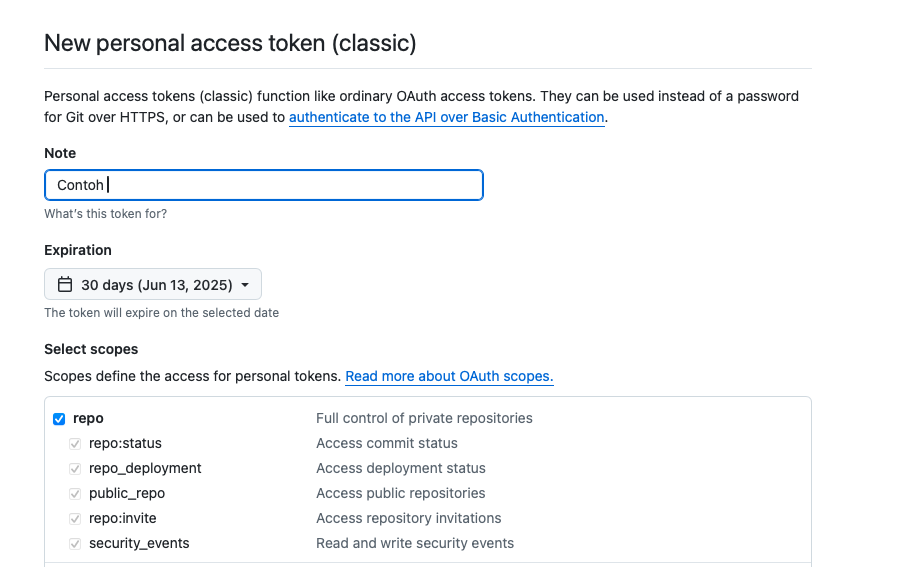
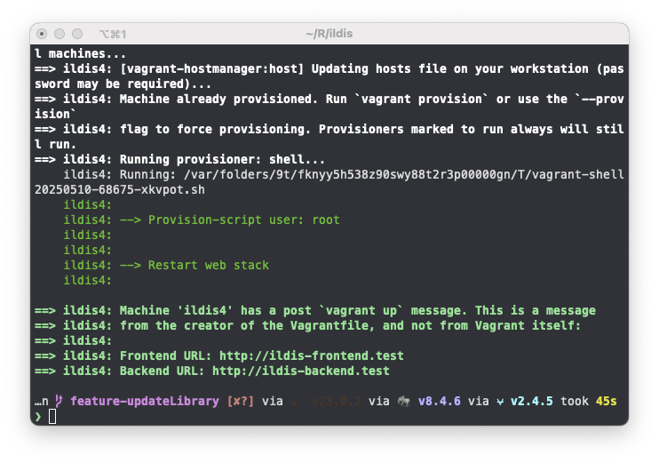
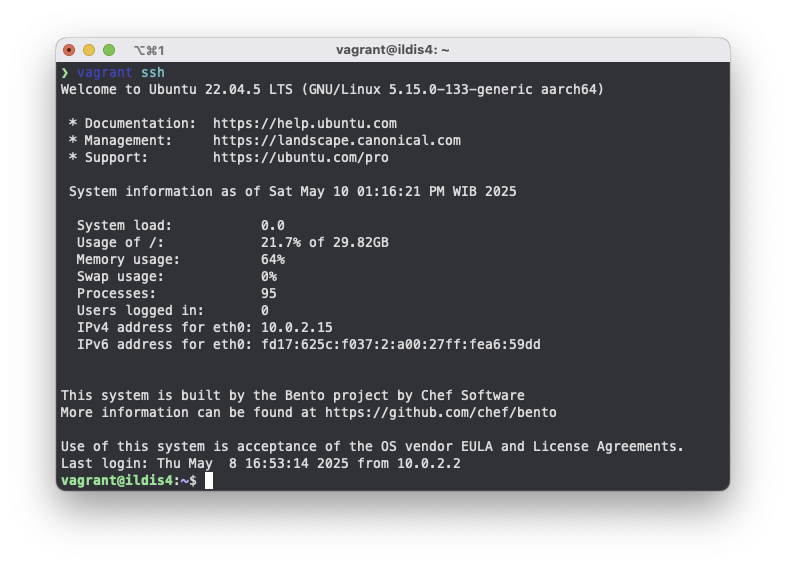

import {Aside} from '@astrojs/starlight/components';
import {Code} from '@astrojs/starlight/components';
import {Tabs, TabItem} from '@astrojs/starlight/components';
import configExample from 'config_example/env?raw';
import configCookie from 'config_example/env_cookie_validation_key?raw';
import databaseConfiguration from 'config_example/env_database?raw';
import nginx from 'config_example/nginx?raw';
import apache from 'config_example/apache?raw';
import vagrantConfig from 'config_example/vagrant?raw'


<Aside type="tip">
    Pastikan pada perangkat anda telah terpasang [Git](https://git-scm.com/downloads), PHP, dan
    [Composer](https://getcomposer.org/download/). Lihat [Persyaratan Sistem](/persyaratan-sistem)
</Aside>

Instalasi ILDIS pada halaman ini paling menggambarkan kondisi instalasi pada lingkungan pengembangan (_development_). Namun section [instalasi manual](#instalasi-manual-tanpa-vagrant) terutama pada Sistem Operasi Ubuntu dapat mewakili kondisi lingkungan _production_. Anda dapat langsung ke bagian [instalasi manual](#instalasi-manual-tanpa-vagrant) jika anda ingin segera memasang ILDIS pada lingkunga _production_ lalu melihat referensi konfigurasi yang direkomendasikan pada halaman [deployment](/deployment).


## Unduh ILDIS

### Git Clone
Untuk mengunduh ILDIS anda dapat melakukan clone repositori ildis menggunakan perintah berikut :

export const cloneCommand = `git clone https://github.com/bphndigitalservice/ildis.git`;

<Code code={cloneCommand} lang="shell"/>

### Ekstrak Manual
Anda juga dapat mengunduh rilis terakhir ILDIS pada website <a href="https://github.com/bphndigitalservice/ildis/releases" target="_blank">di sini</a>

<br/>
<br/>
---

## Vagrant
ILDIS dapat dipasang pada berbagai macam sistem operasi seperti Linux, Windows, atau macOS. Pada tahap development kami menyarankan anda untuk menggunakan Vagrant.

<Aside type="caution">
    Vagrant adalah alat yang sangat berguna untuk _development_, tetapi tidak disarankan untuk digunakan dalam _production_. Alat lain seperti Terraform dan platform cloud lebih cocok untuk lingkungan produksi yang membutuhkan skalabilitas, kontrol yang lebih ketat, dan keamanan yang lebih baik.
</Aside>

Instalasi ILDIS dengan menggunakan vagrant adalah cara yang paling mudah dan cepat. Namun sebelum itu pastikan terlebih dahulu bahwa pada perangkat anda telah terpasang [Vagrant](https://developer.hashicorp.com/vagrant/install) dan [VirtualBox](https://www.virtualbox.org/wiki/Downloads).

export const vagrantUp = `vagrant up`;

PERTHATIAN!! Sebelum itu anda harus membuat Github Personal Token terlebih dahulu <a href="https://github.com/settings/tokens" target="_blank">di sini</a>. Pada halaman tersebut anda dapat memilih **Generate New Token** lalu pilih **Generate new token (classic)** dan pilih *Expiration* sesuai kebutuhan anda. Centang **_repo_** seperti pada gambar :



Selanjutnya copy Personal Access Token Tersebut ke file `vagrant/config/vagrant-local.yml` pada bagian `github_token` :

<Code code={vagrantConfig} title="vagrant-local.yml" lang="yaml" mark={['github_token']}/>

Setelah itu anda dapat mengeksekusi perintah berikut :

<Code code={vagrantUp} title="iTerm" lang="shell"/>

Berikut adalah contoh proses booting virtual machine dengan perintah vagrant up berhasil :




Jika virtual machine sudah berjalan, selanjutnya adalah masuk ke virtual machine menggunakan ssh dengan perintah berikut:

export const vagrantSsh = `vagrant ssh`;

<Code code={vagrantSsh} title="iTerm" lang="shell"/>

Maka anda akan masuk ke dalam virtual machine dengan ildisv4 seperti contoh berikut:



Selanjutnya adalah melakukan setup project ILDIS dengan perintah berikut :

export const initializeYii2 = `cd /app && composer install && php init`;

<Code code={initializeYii2} title="vagrant@ildis4:~" lang="shell"/>

Jika semua proses sudah selesai selanjutnya anda dapat melakukan konfigurasi ILDIS pada file `.env`. Sebelum itu copy terlebih dahulu file konfigurasi contoh dengan perintah berikut:

export const envFileCopy = `cp .env.example .env`;

<Code code={envFileCopy} title="vagrant@ildis4:~" lang="shell"/>

Setelah itu anda dapat mengubah konfigurasi file `.env` sesuai dengan kebutuhan anda. Berikut adalah isi dari file konfigurasi:

<Code code={configExample} lang="text" title=".env" lang="shell"/>

Jika semua konfigurasi sudah selesai, buat database dengan nama sesuai dengan yang anda buat pada file konfigurasi. Di sini misalnya `ildis_v4`:

<Code code={`mysql -u root`} lang="shell" title="vagrant@ildis4:~"/>

Lalu buat database dengan perintah berikut:

<Code code={`create database ildis_v4; //tekan enter\nexit;`} lang="shell" title="mysql"/>


Selanjutnya anda dapat melakukan migrasi database dengan perintah berikut:

export const migrateDatabase = `mysql -u root ildis_v4 < /app/DATABASE/ildis_v4.sql`;

<Code code={migrateDatabase} lang="shell" title="vagrant@ildis4:~"/>

Jika semua berjalan dengan baik maka anda dapat mengakses laman ILDIS pada :
- http://ildis-frontend.test (untuk frontend)
- http://ildis-backend.test (untuk halaman admin)

Jika semua berjalan lancar maka anda akan mendapatkan tampilan seperti ini :


<Aside type="caution">
    1. Untuk halaman backend (login admin) anda memerlukan Google Recaptcha Key. Lihat [Konfigurasi Tambahan](#google-recaptcha-key)
    2. Anda Perlu membuat Cookie Validation Key untuk mengamankan session. Lihat [Konfigurasi Tambahan](#cookie-validation-keyy)
</Aside>

## Instalasi Manual (Tanpa Vagrant)

Jika Anda tidak ingin menggunakan Vagrant, ILDIS dapat dipasang secara manual pada sistem Anda. Namun perlu dipahami bahwa instalasi manual membutuhkan pemahaman dasar tentang konfigurasi server web (Apache/Nginx), virtual host, serta permission file dan folder.

Bagian ini menjelaskan cara instalasi manual pada lingkungan :
- **Windows menggunakan XAMPP**
- **Linux/macOS menggunakan PHP, Composer, dan MySQL**

---

### A. Linux / macOS

#### 1. Instalasi Prasyarat

export const installPrerequisitesUbuntu = `sudo add-apt-repository ppa:ondrej/php -y \nsudo apt-get update\nsudo apt install -y php7.4 php7.4-cli php7.4-common php7.4-curl php7.4-mbstring php7.4-intl php7.4-mysql php7.4-xml php7.4-fpm php7.4-gd php7.4-zip php7.4-xdebug unzip nginx mysql-server`;
export const installPrerequisitesMac = `brew tap shivammathur/php\nbrew install php@7.4 mysql nginx git composer`;

<Tabs>
    <TabItem label="macOS (Homebrew)">
        <Code code={installPrerequisitesMac} lang="shell" />
        Setelah itu, tambahkan PHP 7.4 ke PATH:

        <Code code={`echo 'export PATH="/opt/homebrew/opt/php@7.4/bin:$PATH"' >> ~/.zshrc\nsource ~/.zshrc`} lang="shell" />
    </TabItem>
    <TabItem label="Ubuntu">
        <Code code={installPrerequisitesUbuntu} lang="shell" />
        > **Catatan:** Jika `add-apt-repository` belum tersedia, jalankan `sudo apt-get install software-properties-common`.
    </TabItem>
</Tabs>

#### 2. Unduh dan Pasang ILDIS

export const cloneCommandLinuxMac = `cd /var/www
git clone https://github.com/bphndigitalservice/ildis.git
composer install
php init`;

<Code code={cloneCommandLinuxMac} lang="shell" />

#### 3. Konfigurasi .env

<Code code={`cp .env.example .env`} lang="shell" />

Edit file .env:
<Code code={databaseConfiguration} lang="env" title=".env" />

#### 4. Import Database

<Code code={`mysql -u root -p ildis_v4 < DATABASE/ildis_v4.sql`} lang="shell" />

#### 5. Konfigurasi Apache Virtual Host

Buat file:

<Code code={`sudo nano /etc/apache2/sites-available/ildis.conf`} lang="shell" />

<Code code={apache} lang="apache" />

#### Konfigurasi Nginx

<Code code={`sudo nano /etc/nginx/sites-available/ildis`} lang="shell" />

<Code code={nginx} lang="nginx" title="nginx" />

Lalu aktifkan config-nya:

<Tabs>
    <TabItem label="macOS">
        <Code code={`sudo brew services restart nginx`} lang="shell" />
    </TabItem>
    <TabItem label="Ubuntu">
        <Code code={`sudo systemctl restart nginx`} lang="shell" />
    </TabItem>
</Tabs>

#### 6. Edit /etc/hosts

<Code code={`127.0.0.1 ildis-frontend.test
127.0.0.1 ildis-backend.test\n
`} lang="hosts" />

Akses Aplikasi :

- http://ildis-frontend.test (untuk frontend)
- http://ildis-backend.test (untuk halaman admin)


<Aside type="caution">
    1. Untuk halaman backend (login admin) anda memerlukan Google Recaptcha Key. Lihat [Konfigurasi Tambahan](#google-recaptcha-key)
    2. Anda Perlu membuat Cookie Validation Key untuk mengamankan session. Lihat [Konfigurasi Tambahan](#cookie-validation-keyy)
</Aside>

<br/>
<br/>

---


### B. Windows dengan XAMPP

<Aside type="caution">
    Jangan gunakan XAMPP pada lingkungan production.
</Aside>

#### 1. Unduh dan Pasang XAMPP

- Unduh dari [https://www.apachefriends.org/index.html](https://www.apachefriends.org/index.html)
- Install dengan pilihan default
- Aktifkan Apache dan MySQL melalui XAMPP Control Panel

#### 2. Unduh ILDIS

Clone ILDIS ke dalam folder `htdocs`:

<Code code={`cd C:\\xampp\\htdocs\ngit clone https://github.com/bphndigitalservice/ildis.git ildis`} lang="shell" />

Atau ekstrak file rilis dari [GitHub Releases](https://github.com/bphndigitalservice/ildis/releases)

#### 3. Setup Proyek

<Code code={`cd C:\\xampp\\htdocs\\ildis\ncomposer install\nphp init`} lang="powershell" />

#### 4. Buat File .env

<Code code={`copy .env.example .env`} lang="powershell" />

Edit file `.env` dan sesuaikan nilai dengan kredensial MySQL / MariaDB anda.

#### 5. Import Database

<Code code={`mysql -u root -p ildis_v4 < DATABASE/ildis_v4.sql`} lang="powershell" />

Atau gunakan phpMyAdmin untuk import manual.

#### 6. Buat Virtual Host

Edit file `C:\xampp\apache\conf\extra\httpd-vhosts.conf`,  tambahkan :


<Code code={apache} lang="apache" title="httpd-vhosts.conf"  />

Edit file hosts:

<Code code={`C:\\Windows\\System32\\drivers\\etc\\hosts`} lang="powershell" title="hosts" />

Tambahkan baris berikut:
<Code code={`127.0.0.1 ildis-frontend.test ildis-backend.test`} lang="text" title="hosts" />

Restart Apache dari XAMPP Control Panel.

<br/>
<br/>

---
## Konfigurasi Tambahan

### Cookie Validation Key

Pada halaman [konfigurasi](/konfigurasi) terdapat entry `COOKIE_VALIDATION_KEY_BE` dan `COOKIE_VALIDATION_KEY_FE` kedua entry tersebut harus diisi untuk validasi cookie agar mekanisme keamanan dapat berjalan dengan benar.

export const highlights = ['COOKIE_VALIDATION_KEY_BE', 'COOKIE_VALIDATION_KEY_FE'];

<Code code={configCookie} title=".env" lang="text" mark={highlights} />

Untuk generate `COOKIE_VALIDATION_KEY_BE` / `COOKIE_VALIDATION_KEY_FE` anda dapat mengeksekusi perintah berikut :


export const generateKey = `bash <(curl -s https://raw.githubusercontent.com/bphndigitalservice/ildis-cookie-validation-generator/refs/heads/main/generate_cookie_keys.sh)`;
export const generateKeyPowershell = `$phpScript = Invoke-RestMethod -Uri "https://raw.githubusercontent.com/bphndigitalservice/ildis-cookie-validation-generator/refs/heads/main/generate_cookie_keys.php"
php -r $phpScript`


<Tabs>
    <TabItem label="Linux / macOS">
        <Code code={generateKey} title="Terminal" lang="shell" />
    </TabItem>
    <TabItem label="Windows">
        <Code code={generateKeyPowershell} title="Windows PowerShell" lang="powershell" />
    </TabItem>
</Tabs>

<br/>
<br/>

---

### Google Recaptcha Key

Google reCAPTCHA v3 membantu melindungi ILDIS dari bot tanpa interaksi pengguna pada halaman Login Admin (backend). Berikut ini adalah langkah-langkah untuk mendapatkan **Site Key** dan **Secret Key** dari Google reCAPTCHA v3.

####  Langkah-langkah Mendapatkan reCAPTCHA v3 Key

##### 1. Kunjungi Halaman Admin Google reCAPTCHA

Buka link berikut di browser Anda:

```
https://www.google.com/recaptcha/admin/create
```

> Anda harus login menggunakan akun Google.

##### 2. Daftarkan Situs Baru

Isi form yang tersedia dengan detail sebagai berikut:

- **Label**
Nama identifikasi untuk project kamu. Misalnya: `MyILDIS`

- **reCAPTCHA Type**
Pilih opsi:
```
reCAPTCHA v3
  ```

- **Domains**
Masukkan domain tempat anda akan menggunakan reCAPTCHA, tanpa `https://` dan tanpa `/`. Contoh:
```
ildis-backend.test
jdih.kemenkum.go.id
```

- **Owners**
Secara default diisi dengan akun anda. Bisa ditambahkan owner lain jika perlu.

- **Accept the reCAPTCHA Terms of Service**
Centang checkbox ini untuk menyetujui ketentuan.

- (Optional) Centang "Send alerts to owners" jika ingin menerima notifikasi keamanan dari Google.

Klik tombol **Submit** untuk mendaftar.


##### 3. Salin Site Key dan Secret Key

Setelah submit, kamu akan melihat dua key penting:

- **Site Key**
Copy value pada bagian ini ke entry `COOKIE_VALIDATION_KEY_FE`.

- **Secret Key**
Copy value pada bagian ini ke entry `COOKIE_VALIDATION_KEY_BE`.


##### Referensi :

- [Google reCAPTCHA Docs](https://developers.google.com/recaptcha/docs/v3)
- [Admin Console](https://www.google.com/recaptcha/admin)

---


