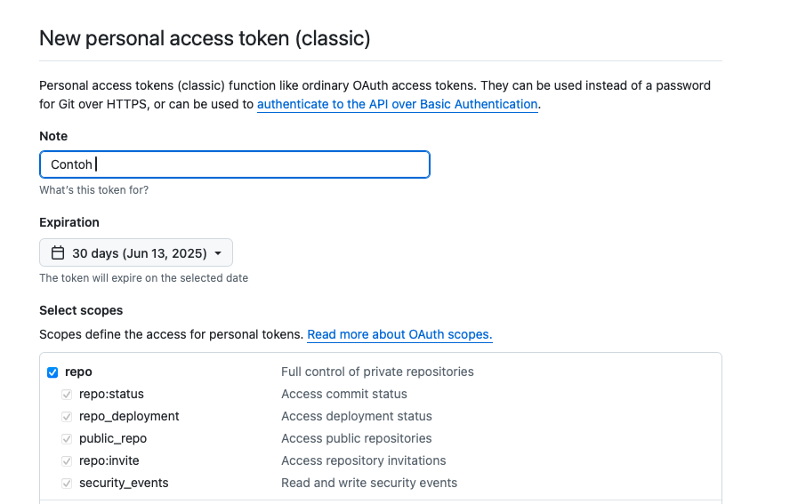
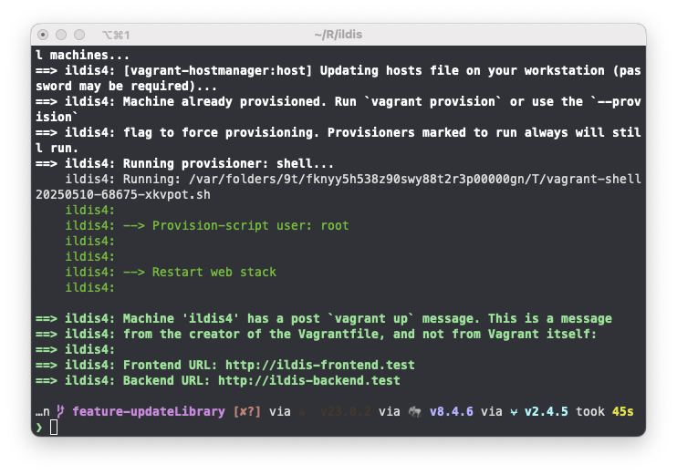
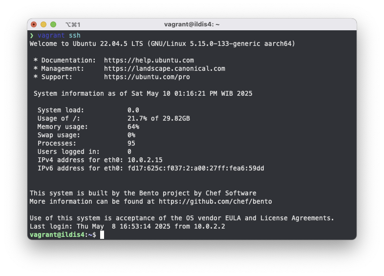

import { Aside } from '@astrojs/starlight/components';
import { Code } from '@astrojs/starlight/components';
import vagrantConfig from '../config_example/vagrant?raw';
import configExample from '../config_example/env?raw';

<Aside type="caution">
  Vagrant adalah alat yang sangat berguna untuk _development_, tetapi tidak disarankan untuk digunakan dalam _production_. Alat lain seperti Terraform dan platform cloud lebih cocok untuk lingkungan produksi yang membutuhkan skalabilitas, kontrol yang lebih ketat, dan keamanan yang lebih baik.
</Aside>

Instalasi ILDIS dengan menggunakan vagrant adalah cara yang paling mudah dan cepat untuk development. Namun sebelum itu pastikan terlebih dahulu bahwa pada perangkat Anda telah terpasang [Vagrant](https://developer.hashicorp.com/vagrant/install) dan [VirtualBox](https://www.virtualbox.org/wiki/Downloads).

export const vagrantUp = `vagrant up`;

PERHATIAN!! Sebelum itu Anda harus membuat Github Personal Token terlebih dahulu <a href="https://github.com/settings/tokens" target="_blank">di sini</a>. Pada halaman tersebut Anda dapat memilih **Generate New Token** lalu pilih **Generate new token (classic)** dan pilih _Expiration_ sesuai kebutuhan Anda. Centang **_repo_** seperti pada gambar:

Selanjutnya copy Personal Access Token Tersebut ke file `vagrant/config/vagrant-local.yml` pada bagian `github_token`:

<Code code={vagrantConfig} title="vagrant-local.yml" lang="yaml" mark={['github_token']}/>

Setelah itu Anda dapat mengeksekusi perintah berikut:

<Code code={vagrantUp} title="Terminal" lang="shell"/>

Berikut adalah contoh proses booting virtual machine dengan perintah vagrant up berhasil:

Jika virtual machine sudah berjalan, selanjutnya adalah masuk ke virtual machine menggunakan ssh dengan perintah berikut:

export const vagrantSsh = `vagrant ssh`;

<Code code={vagrantSsh} title="Terminal" lang="shell"/>

Maka Anda akan masuk ke dalam virtual machine dengan ildisv4 seperti contoh berikut:

Selanjutnya adalah melakukan setup project ILDIS dengan perintah berikut:

export const initializeYii2 = `cd /app && composer install && php init`;

<Code code={initializeYii2} title="vagrant@ildis4:~" lang="shell"/>

Jika semua proses sudah selesai selanjutnya Anda dapat melakukan konfigurasi ILDIS pada file `.env`. Sebelum itu copy terlebih dahulu file konfigurasi contoh dengan perintah berikut:

export const envFileCopy = `cp .env.example .env`;

<Code code={envFileCopy} title="vagrant@ildis4:~" lang="shell"/>

Setelah itu Anda dapat mengubah konfigurasi file `.env` sesuai dengan kebutuhan Anda. Berikut adalah isi dari file konfigurasi:

<Code code={configExample} lang="text" title=".env" lang="shell"/>

Jika semua konfigurasi sudah selesai, buat database dengan nama sesuai dengan yang Anda buat pada file konfigurasi. Di sini misalnya `ildis_v4`:

<Code code={`mysql -u root`} lang="shell" title="vagrant@ildis4:~"/>

Lalu buat database dengan perintah berikut:

<Code code={`create database ildis_v4; //tekan enter\nexit;`} lang="shell" title="mysql"/>

Selanjutnya Anda dapat melakukan migrasi database dengan perintah berikut:

export const migrateDatabase = `mysql -u root ildis_v4 < /app/DATABASE/ildis_v4.sql`;

<Code code={migrateDatabase} lang="shell" title="vagrant@ildis4:~"/>

Jika semua berjalan dengan baik maka Anda dapat mengakses laman ILDIS pada:
- http://ildis-frontend.test (untuk frontend)
- http://ildis-backend.test (untuk halaman admin)

Jika semua berjalan lancar maka Anda akan mendapatkan tampilan seperti ini:

---

## Langkah Selanjutnya

Setelah instalasi berhasil, lanjutkan ke halaman berikut untuk konfigurasi awal:

- [Langkah Setelah Instalasi](/v4/instalasi/setelah-instalasi)